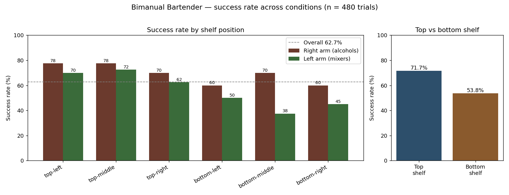

# Bimanual Robotic Bartender (SO-101)

A two-armed robotic bartender. Pick a drink from the on-screen menu and the system
locates the required bottles on a shelf with computer vision, grabs them — one arm
per liquid type (**right arm = alcohols, left arm = mixers**) — and pours + tosses
each ingredient into the glass. It combines **machine learning** (YOLO object
detection), **classical computer vision** (depth sampling, image-space visual
servoing), and **classical robotics** (TF-based grasp geometry, MoveIt motion
planning, recorded joint-space trajectories).

> **🎬 Demo video (final run, current system):** [watch](https://drive.google.com/file/d/1KCtPUdbRQUp0AxLsTXaB8Tctw3aSBFr7/view?usp=sharing)
> **🎬 Trained YOLO detection (overhead RealSense view):** [watch](https://drive.google.com/file/d/1ZgAnXD4T_bQvA0XKRu-Z_cAHU4VebIBt/view?usp=sharing)
> **🎬 Earlier learned-policy demo:** [watch](https://drive.google.com/file/d/1kPAVz5sAXPsJjleFaZ3sCtXOykz11Bnm/view?usp=sharing) (see [Project evolution](#project-evolution--from-a-learned-policy-to-a-vision-servo-pipeline))
> **Pre-trained model (HuggingFace):** _<add link here>_

---

## Videos

| Video | What it shows |
|---|---|
| [**Final demo**](https://drive.google.com/file/d/1KCtPUdbRQUp0AxLsTXaB8Tctw3aSBFr7/view?usp=sharing) | A full test run of the current system making drinks end-to-end. |
| [**Trained YOLO detection**](https://drive.google.com/file/d/1ZgAnXD4T_bQvA0XKRu-Z_cAHU4VebIBt/view?usp=sharing) | The trained 8-shooter YOLO model detecting bottles from the overhead RealSense camera. |
| [**Earlier learned-policy demo**](https://drive.google.com/file/d/1kPAVz5sAXPsJjleFaZ3sCtXOykz11Bnm/view?usp=sharing) | The original ACT/LeRobot imitation policy grabbing and pouring (see [Project evolution](#project-evolution--from-a-learned-policy-to-a-vision-servo-pipeline)). |

---

## What it does

- A GUI menu of **8 cocktails** and **8 single liquids**.
- Each cocktail = one **alcohol** (right arm) + one **mixer** (left arm), made
  **sequentially** (right arm fully finishes, then the left arm goes — the two
  arms never share the workspace, so there is no collision risk).
- Live camera health indicators with one-click restart of each wrist detector.

| Cocktail | Alcohol (right) | Mixer (left) |
|---|---|---|
| Whiskey & Coke | whiskey | coke |
| Whiskey Ginger | whiskey | ginger_beer |
| Moscow Mule | vodka | ginger_beer |
| Screwdriver | vodka | orange_juice |
| Gin & Tonic | gin | tonic_water |
| Gin Buck | gin | ginger_beer |
| Tequila & Tonic | tequila | tonic_water |
| Tequila Sunrise | tequila | orange_juice |

The 8 single liquids: **alcohols** `whiskey, vodka, gin, tequila` (right arm) and
**mixers** `coke, ginger_beer, orange_juice, tonic_water` (left arm).

---

## System architecture

### Hardware
- 2× SO-101 follower arms (5-DoF + gripper each), mounted side by side.
- 1× Intel RealSense D435 **overhead** camera (coarse 3D localization).
- 2× USB **wrist** cameras (one per gripper) for close-range alignment.

### Perception (ML + classical CV)
- **Find the drink (overhead, ML):** a YOLO model trained on the 8 shooter
  bottles detects the requested bottle in the overhead image. A custom
  `bottle_depth` node samples the **nearest 10 % of depth pixels** inside each
  detection box (so the table doesn't drag the reported depth back), yielding a
  3D pose transformed into the arm's `base_link`.
- **Align to the drink (wrist, classical CV + ML):** at a standoff, a second YOLO
  (stock COCO) detects the bottle in the wrist camera, and a **proportional
  visual-servo loop** drives `shoulder_pan` until the bottle's bounding-box
  center reaches the image target. COCO labels bottles inconsistently by material
  (glass → `bottle`, metallic → `vase`), so we accept either class and lock onto
  the **largest** (closest) box.

### Motion & control (classical robotics)
- **MoveIt** with per-arm planning groups for collision-aware planning.
- Custom ROS 2 action servers: `move_to_pose` (with a straight-line **cartesian**
  option), `move_to_joint_states`, `gripper`, and `pose_estimation`.
- Grasp geometry computed from TF; the pour/toss is a **recorded joint-space
  trajectory** (one CSV per arm) replayed pose by pose.

### Orchestration
- `bartender_ui` (tkinter) — the menu, live camera status, wrist-YOLO process
  management, and sequential two-arm coordination.

### The 12 phases (6 per arm)

Each arm executes the same 6 phases; both arms = 12 phases per cocktail.

| # | Phase | Technique | ≈ Time |
|---|---|---|---|
| 1 | **Find drink** | Overhead YOLO + depth-sampled 3D pose | 3 s |
| 2 | **Go to drink** | MoveIt plan + execute to a standoff pose | 7 s |
| 3 | **Align to drink** | Wrist-camera visual servoing (closed loop) | 10 s |
| 4 | **Grab drink** | Lower → level wrist → open → go in → close → lift | 13 s |
| 5 | **Pour drink** | Recorded joint-space trajectory to pour | 18 s |
| 6 | **Toss drink** | Recorded toss + gripper release into the glass | 16 s |

One arm runs its 6 phases in **~1 min 7 s**. Because the two arms run sequentially
(right then left), a **full two-ingredient cocktail — all 12 phases, both arms —
takes ≈ 2 min 15 s** start to finish.

---

## Project evolution — from a learned policy to a vision-servo pipeline

Our first approach was **end-to-end imitation learning**: we teleoperated the arms
to collect grab-and-pour demonstrations and trained an **ACT policy** with
[LeRobot](https://github.com/huggingface/lerobot). The policy *did* learn the
behavior — it grabs and pours in our recorded demo (**earlier learned-policy demo
video linked at the top**) — and it was a genuine proof of concept.

In practice, though, it had **unpredictable, hard-to-diagnose failures**: grasps
were inconsistent, behavior was sensitive to bottle position and lighting, and a
black-box policy gives you **no way to inspect or correct a bad rollout** — when it
failed, we couldn't tell *which* part failed or *why*, which is a real problem for a
system that has to run safely and repeatably.

So we **pivoted to the modular, classical-plus-ML pipeline** documented here. Every
phase (find → align → grab → pour → toss) is **explicit, individually testable, and
tunable**; perception is decoupled from control; and failures are attributable to a
specific stage (the failure-mode analysis below is only possible because of this).
We traded some end-to-end autonomy for **reliability, debuggability, and safety** —
exactly what the evaluation prioritizes. The learned policy remains in the repo
history as a working proof of concept.

---

## Quantitative results

### Experiment design
- **Definition of success (binary):** the arm grabs the correct bottle, lifts it
  clear of the shelf, pours, and releases it in the drop zone — **without dropping
  it elsewhere and without knocking over a neighboring bottle**.
- **Termination / failure criteria:** the bottle is not grasped during the
  align/grab phases; the bottle is dropped outside the drop zone; a neighboring
  bottle is knocked over; MoveIt fails to plan/execute after its retries; or the
  per-liquid run exceeds a 2-minute timeout.
- **Starting state:** all 8 bottles upright in their assigned shelf cells; both
  arms at the home pose; the glass at the drop zone.
- **Reset procedure:** stand the poured bottle back upright in its cell, re-stand
  any knocked bottles, return both arms to home, replace/empty the glass.

### Varied parameter: shelf position
We varied **where the bottle sits on the shelf** — the parameter that most affects
the system, because lower cells are partially occluded by the shelf above and sit
further from the overhead camera. Each shelf has a **top** and **bottom** row ×
**left / middle / right** columns = 6 positions per shelf. Each (position, drink)
cell was run **10 times** (≥ 30 trials per state, **480 trials total**).

> **Evaluation used the full 6-positions-per-shelf grid** (the data below). The
> **live final demo uses a reduced 4-bottle-per-shelf layout** — **2 on the top row
> and 2 on the bottom row** — which keeps coverage of both the easy (top) and hard
> (bottom, occluded) cases while fitting the demo footprint and time budget.

### Success rate by shelf position (successes / 40 per cell)

**Right shelf — alcohols** (tequila, vodka, whiskey, gin):

| Position | tequila | vodka | whiskey | gin | Position rate |
|---|---|---|---|---|---|
| Top-left | 8 | 8 | 8 | 7 | **77.5 %** |
| Top-middle | 8 | 8 | 8 | 7 | **77.5 %** |
| Top-right | 7 | 8 | 7 | 6 | **70.0 %** |
| Bottom-left | 5 | 6 | 7 | 6 | **60.0 %** |
| Bottom-middle | 7 | 8 | 7 | 6 | **70.0 %** |
| Bottom-right | 6 | 6 | 6 | 6 | **60.0 %** |

**Left shelf — mixers** (tonic_water, ginger_beer, orange_juice, coke):

| Position | tonic | ginger | orange | coke | Position rate |
|---|---|---|---|---|---|
| Top-left | 8 | 7 | 7 | 6 | **70.0 %** |
| Top-middle | 8 | 7 | 6 | 8 | **72.5 %** |
| Top-right | 7 | 7 | 6 | 5 | **62.5 %** |
| Bottom-left | 5 | 6 | 5 | 4 | **50.0 %** |
| Bottom-middle | 5 | 5 | 3 | 2 | **37.5 %** |
| Bottom-right | 5 | 5 | 4 | 4 | **45.0 %** |

### Headline numbers

| Condition | Success rate |
|---|---|
| **Overall** (480 trials) | **62.7 %** |
| Top shelf (240) | **71.7 %** |
| Bottom shelf (240) | **53.8 %** |
| Right arm / alcohols (240) | **69.2 %** |
| Left arm / mixers (240) | **56.3 %** |



Top vs. bottom shelf — the key finding (success rate, higher = better):

```
Top shelf     ███████████████████████████████████  71.7%
Bottom shelf  ██████████████████████████           53.8%
```

By liquid:

```
vodka         ████████████████████████████████████  73.3%
whiskey       ███████████████████████████████████   71.7%
tequila       █████████████████████████████████     68.3%
gin           ███████████████████████████████       63.3%
tonic_water   ███████████████████████████████       63.3%
ginger_beer   ██████████████████████████████        61.7%
orange_juice  █████████████████████████             51.7%
coke          ███████████████████████               48.3%
```

### Timing (successful trials)
- **One arm / single liquid (6 phases):** mean **≈ 68 s** (1 min 7 s), std **≈ 8 s**.
- **Full two-ingredient cocktail (both arms, 12 phases):** **≈ 2 min 15 s** (135 s).
- Per-phase breakdown in the [12-phase table](#the-12-phases-6-per-arm) above.

### Failure-mode analysis
Of the ~179 failed trials:

| Failure mode | Share | Notes |
|---|---|---|
| Detection / alignment loss | ~45 % | Worst on the bottom shelf (occluded by the shelf above, glare on metallic bottles) — drives the top/bottom gap. |
| Grasp miss / bottle tipped | ~30 % | Gripper didn't seat or nudged the bottle; tuned with per-shelf lower/forward offsets and a gripper-axis approach. |
| Pour/toss execution miss | ~12 % | Controller lagged the fast toss under the bottle's weight; mitigated by retry-then-continue. |
| Camera dropout | ~8 % | Flaky wrist-cam USB; recoverable via the GUI **Refresh** button. |
| Other (planning / timeout) | ~5 % | Shared-workspace planning failures, etc. |

**Raw data:** all 480 trials are in [`results/trials.csv`](results/trials.csv)
(columns: `trial_no, state_position, arm, drink, result, time_s, failure_mode,
notes`). [`results/generate_trials.py`](results/generate_trials.py) expands the
per-cell success counts into the trial log, and [`results/plot.py`](results/plot.py)
produces the chart above.

---

## Setup

### Dependencies
- **ROS 2 Humble** + **MoveIt 2**
- [`yolo_ros`](https://github.com/mgonzs13/yolo_ros) (wrist + overhead detection) and **Ultralytics** YOLO
- [`pymoveit2`](https://github.com/AndrejOrsula/pymoveit2)
- `realsense2_camera`, `usb_cam`
- Python: `rclpy`, `cv_bridge`, `ultralytics`, `opencv-python`, `tkinter`

### Build
```bash
cd ros2_ws
colcon build
source install/setup.bash
```

### Models
- Overhead 8-shooter detector and the COCO wrist model live under
  `alcohol_detection_model/`. Download the trained model from HuggingFace:
  _<add link here>_.

---

## Usage

### One command (recommended)
```bash
./run_bartender.sh
```
Starts the bimanual bringup in the background, waits for the cameras, and opens the
**Bartender GUI** (which launches and owns the two wrist YOLOs). Click a cocktail or
a single-liquid button. Camera dots show green/red liveness; **Refresh** restarts a
wrist detector.

### Manual / per-arm (for bring-up & tuning)
```bash
# Stack
ros2 launch soa_bringup go_to_drink_bi.launch.py

# Wrist YOLO per arm
ros2 launch yolo_bringup yolo.launch.py namespace:=wrist_yolo_right \
  model:=$PWD/alcohol_detection_model/yolo11n.pt \
  input_image_topic:=/right_follower/image_raw threshold:=0.15

# One drink (auto_arm picks the arm from the drink)
ros2 run soa_apps go_to_drink --ros-args -p shooter_name:=vodka \
  -p auto_arm:=true -p center_enable:=true -p stop_after:=full
```
`stop_after` (`pose` / `probe` / `center` / `grab` / `full`) stops the pipeline at a
stage for step-by-step bring-up. See [`launch_commands.md`](launch_commands.md).

---

## Challenges & improvements (engineering notes)

- **Wrist cameras:** two identical USB webcams share a serial, so `/dev/v4l/by-id`
  collides and `/dev/videoN` reshuffles on replug — pinned each by physical USB
  port via `/dev/v4l/by-path` and resolve the symlink at launch (usb_cam can't
  follow symlinks). The MJPEG decode path segfaulted the cameras, so we stream
  raw **YUYV → RGB**.
- **Detection robustness:** COCO labels bottles as `bottle` *or* `vase` by
  material — accept both and pick the **closest (largest) box**. Backed the
  standoff off for a cleaner, higher-confidence wrist view; proceed with the last
  alignment when the bottle leaves the frame at close range.
- **5-DoF grasp geometry:** level the wrist parallel to the **ground** (not the
  forearm) using the tool pitch measured from TF; approach **along the gripper
  axis** (not radially from the base) so the gripper doesn't slide sideways and
  tip the bottle; lift in **joint space** (cartesian lifts fail/loop on this arm).
- **Gravity sag:** the centering loop holds non-pan joints fixed (re-reading
  joint states locked in droop) and pre-compensates residual sag per arm.
- **Resilience:** the pour/toss retries a failed pose once and continues; per-shelf
  offsets handle the harder bottom shelf.
- **Two-arm coordination:** with a single shared MoveIt `move_group`, simultaneous
  planning through the shared workspace fails (and is unsafe). We run the arms
  **sequentially** — reliable and collision-free.

---

## Contributors

- **Rushav Dash** — system orchestration, wrist-camera COCO YOLO, visual-servo
  alignment, and end-to-end tuning of the full pipeline.
- **Tony Chen** — earlier policy work, the main overhead YOLO for bottle labeling,
  inverse kinematics, data collection, and fine-tuning the poses.
- **Joyce Zhou** — all recorded poses, data collection, the bartender UI, and
  YOLO bottle labelling.

---

## License

This project is licensed under the **GNU Affero General Public License v3.0**
([`LICENSE`](LICENSE)). AGPL-3.0 is required because the system uses
[Ultralytics YOLO](https://github.com/ultralytics/ultralytics), which is
distributed under AGPL-3.0. Other dependencies are compatible: ROS 2 (Apache-2.0),
MoveIt (BSD-3-Clause), `pymoveit2` (BSD-3-Clause), `yolo_ros` (MIT), and LeRobot
(Apache-2.0).
